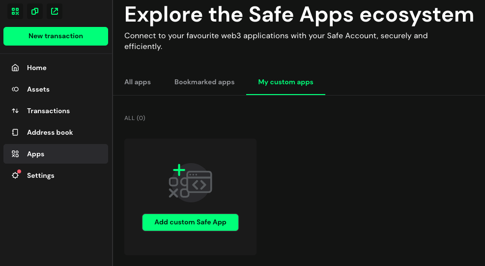
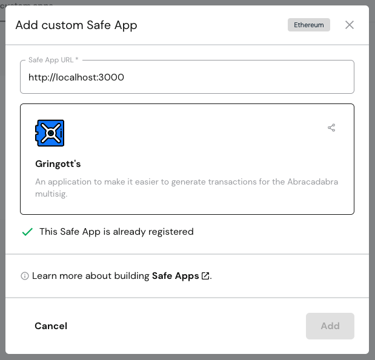

# Gringott's

Gringott's is a Gnosis Safe app that makes it easy to interact with Abracadabra Cauldrons. The production version of Gringott's can be found [here](https://gringotts-psi.vercel.app/).

## Getting Started

First, run the development server:

```bash
npm run dev
# or
yarn dev
# or
pnpm dev
```

Open [http://localhost:3000](http://localhost:3000) with your browser to see the result.

You can start editing the page by modifying `app/page.tsx`. The page auto-updates as you edit the file. Given that this is a Gnosis safe app, you need to debug / develop inside Gnosis.

## Adding Gringott's to Gnosis Safe

- In order to test the local development of Gringott's, start the development server with `npm run dev`.
- Next, visit the [Abracadabra Gnosis Safe](https://app.safe.global/apps/custom?safe=eth:0xDF2C270f610Dc35d8fFDA5B453E74db5471E126B) and add a custom app by clicking on Apps > My Custom Apps > Add custom Safe App.

  

- Finally, enter `http://localhost:3000` as the Safe App URL and it should detect the locally-running Gringott's.

  
